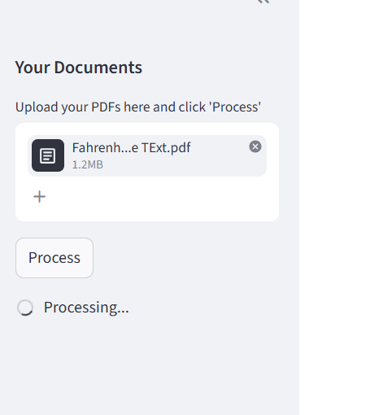
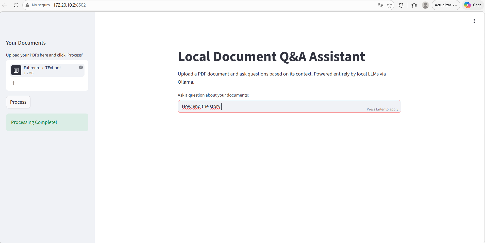
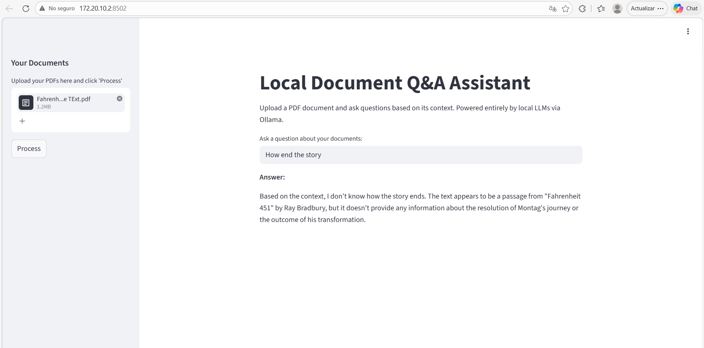

#Technical Report: Local Document Intelligence System
#1. Problem Description
One common problem is when you are staring at a really long technical manual or a dense research paper, needing just one specific piece of information. While modern AI has made "chatting with documents" common, most solutions require uploading files to the cloud. For anyone handling sensitive data, proprietary research, or private documents, this is a deal-breaker due to security risks.

The goal of this project was to close that gap. I built a completely private, off-line AI assistant that can analyze PDFs and answer questions with high accuracy. By keeping the data on the local machine, we eliminate the privacy risk while still gaining the power of a LLM.

#2. System Design and Workflow
This isn't just a simple prompt-and-response bot. To make it work effectively on a local machine, I implemented a Retrieval-Augmented Generation architecture. This creates a multi-step pipeline that ensures the AI actually reads the document before it speaks.

The Pipeline:
Ingestion: The user uploads a PDF with a text that the system using PyPDF2 strip out of the binary file.

Smart Chunking: A 100-page book won't fit into an LLM's "short-term memory" all at once, so used a RecursiveCharacterTextSplitter to break the text into 1,000-character pieces with a 200-character overlap. This overlap is crucial because ensures that context doesn't get cut off mid-sentence.

The Embeddings: Each text chunk is converted into a mathematical vector using a local embedding model.

The Vector Store: These vectors are stored in a FAISS, index this is like super-fast digital library where the system can look up ideas instead of just keywords.

Retrieval & Response: When you ask a question, the system finds the top 3 most relevant chunks from the library and hands them to the LLM. The LLM then writes an answer based only on that evidence.

#3. Model Selection and Justification
Running AI locally requires a careful balance between the intelligence and speed and I chose the Ollama framework to manage the heavy lifting.

The Brain llama 3.2 : I selected this because it is small enough to run smoothly on most modern laptops but smart enough to follow complex instructions without making things up.

The nomic-embed-text: This model is a specialist, because it is designed specifically to turn text into searchable vectors, it is really efficient and overcome many models twice its size for this specific task.

#4. Implementation Details
The application was built using a Python-based stack designed for efficiency:

Streamlit: I used this for the GUI to allow me to build a clean, reactive web interface where users can upload files and chat in real-time without needing a complex web server.

LangChain: This is the the bridge that connects the PDF reader, the vector database, and the LLM into a single, cohesive workflow.

FAISS: I chose this as the vector store because it is really lightweight, running entirely in memory, meaning no external database setup is required for the user.

#5. Discussion & Reflections
The Wins
The system works remarkably well for heavy documents with text. By using a strict prompt template, I was able to force the AI to say "I don't know" if the answer isn't in the PDF, which is much better than the AI guessing.

The Limitations
In this case the "Hardware is King" so on an older laptop, the computing process can take 10–20 seconds but instead on a machine with a dedicated GPU is nearly instant.

The Table Problem: Current PDF parsing struggles with complex tables or diagrams. If the information is hidden inside an image or a weirdly formatted chart, the system might miss it.

Improvements
If I were to take this further, I would implement Optical Character Recognition to analyze images in the PDFs and a Hybrid Search to make finding specific names or dates even more accurate.

#6. Project Visuals
   

 
 

